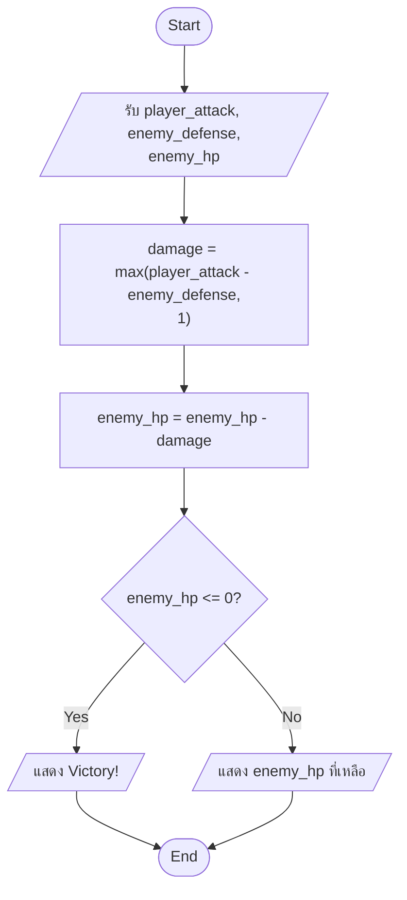
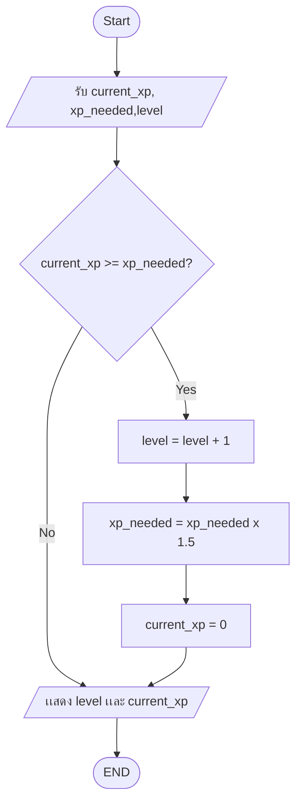
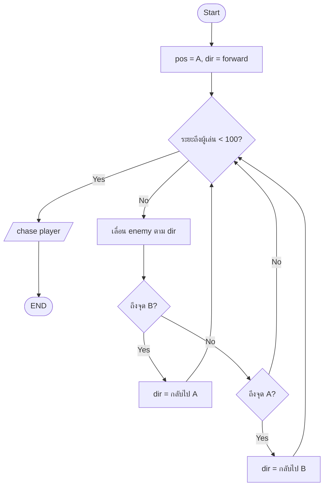

โจทย์ A

```mermaid
flowchart TD
Start([Start]) --> Input[/รับ player_attack, enemy_defense,
enemy_hp/]
Input --> Calc["damage = max(player_attack - enemy_defense,
1)"]
Calc --> Reduce["enemy_hp = enemy_hp - damage"]
Reduce --> D1{enemy_hp <= 0?}
D1 -->|Yes| Win[/แสดง Victory!/]
D1 -->|No| Show[/แสดง enemy_hp ที่เหลือ/]
Win & Show --> End([End])
```

โจทย์ B

```mermaid
flowchart TD
Start([Start]) --> Input[/รับ current_xp, xp_needed,level/]
Input --> D1{current_xp >= xp_needed?}
D1 --> |Yes| LvU["level = level + 1"] 
D1 --> |No| Output[/เเสดง level เเละ current_xp/]
LvU --> xp["xp_needed = xp_needed x 1.5"]
xp --> cxp["current_xp = 0"]
cxp --> Output[/เเสดง level เเละ current_xp/]
Output --> END([END])
```

โจทย์ C

```mermaid
flowchart TD
Start([Start]) --> pos["pos = A, dir = forward"]
pos --> D1{ระยะถึงผู้เล่น < 100?}
D1 --> |Yes| C[/chase player/]
C --> END([END])
D1 --> |No| C2["เลื่อน enemy ตาม dir"]
C2 --> D2{ถึงจุด B?}
D2 --> |Yes| E["dir = กลับไป A"]
D2 --> |No| D3{ถึงจุด A?}
D3 --> |Yes| E2["dir = กลับไป B"]
D3 --> |No| D1
E2 --> D1
E --> D1
```